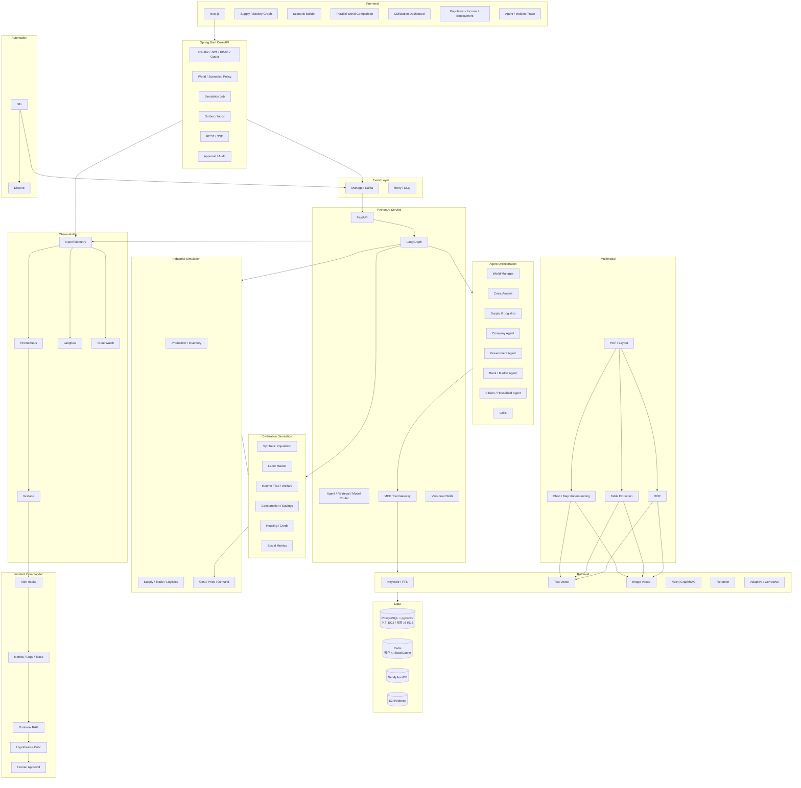
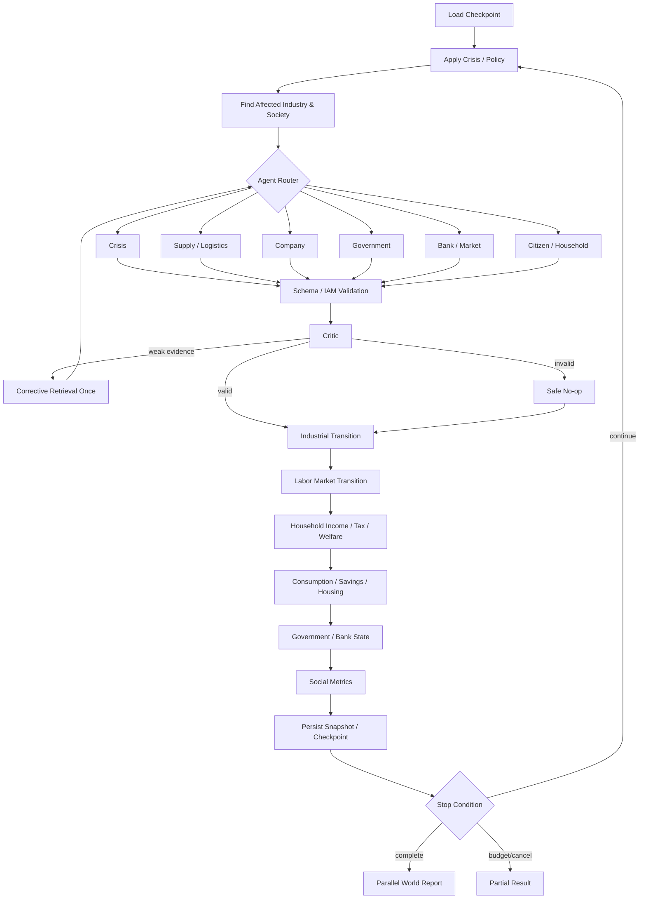

# NEXUS WORLD — 56일 Economic Civilization Simulator + Supply-Chain Digital Twin 완성 계획

## 변경 요약

기존 계획의 기술 스택, RAG·GraphRAG, 공급망 Digital Twin, Parallel World, Backend, AWS, 보안, Evals, Observability, Incident Commander 구조는 유지한다.

배포 인프라는 Day 5에 최종 구조를 확정하지 않는다. 초기에는 Terraform으로 생성한 단일 EC2에 Docker Compose로 배포하고, 실제 부하·가용성·운영 요구가 확인될 때 RDS, Load Balancer, private subnet/NAT, ECS 또는 k3s를 단계적으로 추가한다.

다음 Civilization Layer만 추가한다.

```text
Synthetic Population
→ Citizen / Household
→ Employment / Income
→ Consumption / Savings
→ Tax / Welfare
→ Housing / Credit
→ Company Labor Demand
→ Government Fiscal State
→ 사회·경제 Feedback Loop
```

최종 정체성은 다음과 같다.

> 실제 경제·기업·공급망·인구 통계를 이용해 기업, 정부, 금융기관, 시민과 가구가 상호작용하는 경제 문명 Digital Twin을 만들고, 위기와 정책에 따른 산업·사회 변화를 Parallel World에서 비교하는 근거 기반 Agentic Simulation Platform.

중요한 구현 결정:

- 시민 한 명마다 LLM을 호출하지 않는다.
- 개인·가구의 상태 전이는 deterministic/statistical simulation이 담당한다.
- Citizen/Household Agent는 대표 archetype의 의사결정 정책만 생성한다.
- 동일한 정책은 같은 archetype에 재사용·캐싱한다.
- 실제 개인정보는 수집하지 않고 공식 집계 통계로 synthetic population을 만든다.
- 상세 synthetic population은 한국을 reference implementation으로 구현한다.
- 대만·미국·일본은 국가/소득/고용 cohort 수준으로 시작한다.
- 세계 공급망 graph는 기존처럼 글로벌 범위를 유지한다.

---

# A. 프로젝트 정의

## 최종 이름

**NEXUS WORLD — Agentic Economic Civilization & Supply-Chain Digital Twin**

부제:

> Evidence-Grounded Parallel World Simulator for Industry, Policy and Society

## 한 줄 소개

실제 공급망·기업·무역·인구·노동·소득 데이터를 Knowledge Graph로 연결하고, 기업·정부·은행·시민 Agent와 결정론적 Simulation Engine을 이용해 위기와 정책이 산업 및 사회에 미치는 영향을 Parallel World로 비교하는 플랫폼.

## 해결하려는 문제

기존 경제·공급망 분석은 다음이 분리되어 있다.

- 기업·공장·상품·무역 관계
- 인구·가구·노동·소득·소비
- 정부 세금·보조금·복지
- 은행 신용·금리·가계부채
- 위기 발생과 기업 대응
- 정책이 사회 계층에 미치는 분배 효과

NEXUS WORLD는 이를 하나의 world state에 연결한다.

```text
공급 충격
→ 기업 생산 감소
→ 부품 가격 상승
→ 기업 매출·고용 감소
→ 가구 소득 감소
→ 소비 감소
→ 기업 수요 추가 감소
→ 세수 감소·복지 지출 증가
→ 정부 재정과 정책 변화
```

## 주요 사용자

- 공급망·산업 리스크 분석가
- 정책 분석가
- 기업 전략·조달 담당자
- 경제·사회 연구자
- 금융기관 리스크 담당자
- AI/Backend 운영 엔지니어

## 대표 사용자 시나리오

“대만 지진으로 반도체 생산이 50% 감소했을 때 한국 정부가 기업 보조금, 실업급여 확대, 직업 재교육 중 어떤 정책을 선택해야 생산·고용·가계소득·빈곤·재정 부담을 균형 있게 줄일 수 있는가?”

## 기존 프로젝트와의 차이

- Supply-Chain Digital Twin과 Civilization Microsimulation을 결합한다.
- Agent의 설명이 아니라 실제 world state가 turn마다 변한다.
- 기업 생산 변화가 고용·소득·소비·세금·복지로 전파된다.
- LLM과 수치 simulation을 분리한다.
- 실제 데이터와 가정을 명시적으로 구분한다.
- 산업 지표뿐 아니라 계층별 사회 영향을 비교한다.
- RAG·GraphRAG·Multimodal RAG의 개선을 평가한다.
- 서비스 자체를 Incident Commander가 진단한다.

---

# B. 최종 Architecture



배포 단위는 그대로 유지한다.

- `web`
- `core-api`
- `ai-service/worker`
- `n8n`

Civilization 기능을 별도 microservice로 분리하지 않고 Python simulation package와 Spring domain module로 추가한다.

---

# C. AI 기술 42개 선정

| 기술 | 사용 | 위치 | Priority |
|---|---|---|---|
| RAG | 사용 | 근거·정책·공시 검색 | P0 |
| Hybrid RAG | 사용 | FTS+vector | P0 |
| GraphRAG | 사용 | 산업·사회 관계 traversal | P0 |
| Agentic RAG | 사용 | Agent 추가 조사 | P1 |
| Corrective RAG | 사용 | 품질 미달 재검색 | P1 |
| Multimodal RAG | 사용 | PDF 표·차트·지도 | P1 |
| Self-RAG | Critic에 통합 | claim-evidence 검사 | P1 |
| Adaptive RAG | 사용 | 질문별 검색 routing | P1 |
| Reranking | 사용 | 후보 재정렬 | P1 |
| Semantic/Adaptive Chunking | 사용 | 문서 구조별 분할 | P1 |
| Query Rewriting | 사용 | alias·기간·코드 보강 | P1 |
| Vector DB | 사용 | pgvector | P0 |
| Graph DB | 사용 | Neo4j | P0 |
| Knowledge Graph | 사용 | 산업·사회 Digital Twin | P0 |
| Ontology | 사용 | 범경제·문명 schema | P0 |
| AI Agent | 사용 | 전문 의사결정 | P0 |
| Agent Workflow | 사용 | LangGraph | P0 |
| Multi-Agent | 사용 | 기업·정부·은행·가구 | P1 |
| AI Skill | 사용 | prompt+tool+schema+eval | P1 |
| Agent Memory | 제한 사용 | turn/crisis/policy memory | P1 |
| Tool Calling | 사용 | typed tools | P0 |
| MCP | 사용 | 내부 tool 보안 경계 | P1 |
| Agent Router | 사용 | 필요한 Agent 선택 | P1 |
| Model Routing | 사용 | cheap/balanced/vision | P1 |
| LangChain | 사용 | loader/retriever adapter | P1 |
| LangGraph | 사용 | workflow/checkpoint/HITL | P0 |
| n8n | 사용 | event automation | P1 |
| Prompt Engineering | 사용 | versioned prompts | P0 |
| Context Engineering | 사용 | agent별 최소 context | P0 |
| Harness Engineering | 사용 | budget/permission/timeout | P0 |
| Loop Engineering | 사용 | bounded feedback loop | P0 |
| Graph Engineering | 사용 | temporal society graph | P0 |
| Fine-tuning | 미사용 | 충분한 label 이후 | CUT |
| Local LLM | 선택 실험 | 단순 분류 | P2 |
| Structured Output | 사용 | Pydantic/JSON Schema | P0 |
| Guardrails | 사용 | action/runtime | P0 |
| Sandbox | 사용 | parser/remediation | P1 |
| HITL | 사용 | 정책·운영 high-risk action | P1 |
| AI Evals | 사용 | CI/nightly | P0 |
| Agent Observability | 사용 | Langfuse | P1 |
| Agent Identity/IAM | 사용 | MCP scopes | P1 |
| Discord + AI | 사용 | 보고·승인 | P1 |

---

# D. Spring Backend Architecture

```text
com.nexusworld
├─ auth
├─ user
├─ world
├─ scenario
├─ simulation
├─ job
├─ event
├─ evidence
├─ graph
├─ rag
├─ agent
├─ crisis
├─ company
├─ government
├─ finance
├─ society
│  ├─ population
│  ├─ household
│  ├─ employment
│  ├─ income
│  ├─ consumption
│  ├─ housing
│  └─ welfare
├─ incident
├─ notification
├─ ingestion
├─ audit
├─ common
└─ config
```

추가 모듈 책임:

| 모듈 | 책임 |
|---|---|
| `society.population` | Synthetic population version과 calibration |
| `society.household` | 가구 구성·archetype·상태 |
| `society.employment` | 노동시장·기업 고용 관계 |
| `society.income` | 임금·가처분소득·불평등 |
| `society.consumption` | 상품군별 소비·저축 |
| `society.housing` | 주거 형태·주거비·부채 부담 |
| `society.welfare` | 세금·이전지출·수급 조건 |
| `finance` | 은행·금리·신용·가계/기업 부채 |

---

# E. Python AI Architecture

```text
ai_service/
├─ api/
├─ agents/
│  ├─ crisis/
│  ├─ supply/
│  ├─ company/
│  ├─ government/
│  ├─ bank_market/
│  ├─ citizen_household/
│  └─ critic/
├─ graphs/
├─ skills/
├─ rag/
├─ multimodal/
├─ knowledge/
├─ population/
│  ├─ synthesis/
│  ├─ calibration/
│  ├─ archetypes/
│  └─ validation/
├─ simulation/
│  ├─ core/
│  ├─ semiconductor/
│  ├─ automotive/
│  ├─ electronics/
│  ├─ energy/
│  ├─ logistics/
│  └─ society/
│     ├─ demographics/
│     ├─ labor/
│     ├─ income_tax/
│     ├─ welfare/
│     ├─ consumption/
│     ├─ savings_credit/
│     └─ housing/
├─ tools/
├─ mcp/
├─ memory/
├─ schemas/
├─ llm/
├─ evals/
├─ observability/
├─ security/
└─ workers/
```

---

# F. Database 설계

## 기존 주요 테이블

- `users`, `user_quotas`
- `worlds`, `world_versions`
- `scenarios`, `scenario_branches`
- `simulation_runs`, `turn_snapshots`
- `entity_states`, `flow_states`, `simulation_metrics`
- `agent_actions`, `action_reviews`, `action_evidence`
- `source_documents`, `evidence_items`, `assumptions`
- `visual_assets`, `table_assets`, `rag_chunks`, `image_embeddings`
- `crisis_events`, `policies`
- `approvals`, `incidents`, `incident_hypotheses`
- `outbox_events`, `processed_events`
- `audit_logs`, `eval_runs`

## Civilization 추가 테이블

| 테이블 | 주요 필드 |
|---|---|
| `population_models` | id, country, base_year, sample_size, seed, source_version |
| `synthetic_persons` | id, model_id, age, sex, education, skill, employment_status, weight |
| `synthetic_households` | id, model_id, region_id, household_type, size, tenure, weight |
| `household_members` | household_id, person_id, relationship |
| `employment_states` | run_id, turn, person_id/cohort_id, company/industry, wage, status |
| `household_income_states` | run_id, turn, household_id, labor_income, transfers, tax, disposable_income |
| `consumption_states` | run_id, turn, household_id, category, quantity, expenditure |
| `savings_credit_states` | run_id, turn, household_id, savings, debt, interest, delinquency_risk |
| `housing_states` | run_id, turn, household_id, tenure, rent, mortgage, housing_cost_ratio |
| `labor_market_states` | run_id, turn, region, industry, vacancies, unemployed, wage_index |
| `tax_rules` | policy_version, tax_type, bracket, rate, effective_period |
| `welfare_rules` | policy_version, eligibility_json, benefit_formula, effective_period |
| `social_metrics` | run_id, turn, region, employment_rate, poverty_rate, gini, housing_burden |
| `population_calibration_targets` | model_id, dimension, category, target_value, source_id |
| `population_validation_results` | model_id, metric, value, threshold, status |

`synthetic_persons`와 `synthetic_households`는 실제 개인을 의미하지 않는다. 외부에 row-level로 공개하지 않고 집계 결과만 제공한다.

---

# G. Ontology

## 기존 경제·산업 Entity

- Company
- Facility
- Country
- Region
- Port
- Material
- Component
- Product
- Industry
- Government
- Policy
- ShippingRoute
- TradeFlow
- CrisisEvent
- Evidence
- Assumption

## Civilization Entity 추가

- Citizen
- Household
- DemographicCohort
- Occupation
- Skill
- Employment
- IncomeSource
- ConsumptionCategory
- Tax
- WelfareBenefit
- BankAccount
- Loan
- Dwelling
- HousingMarket
- LaborMarket
- SocialIndicator

## Relationship 추가

```text
Citizen --MEMBER_OF--> Household
Citizen --EMPLOYED_BY--> Company
Citizen --HAS_OCCUPATION--> Occupation
Citizen --HAS_SKILL--> Skill
Citizen --RESIDES_IN--> Region
Citizen --PAYS_TAX_TO--> Government
Citizen --RECEIVES_BENEFIT_FROM--> Government

Household --CONSUMES--> Product
Household --SAVES_AT--> Bank
Household --BORROWS_FROM--> Bank
Household --OWNS_OR_RENTS--> Dwelling
Household --LOCATED_IN--> Region

Company --EMPLOYS--> DemographicCohort
Company --DEMANDS_SKILL--> Skill
Company --PAYS_WAGE_TO--> Household
Company --PAYS_TAX_TO--> Government
Company --BORROWS_FROM--> Bank

Government --TAXES--> Citizen
Government --TAXES--> Company
Government --PROVIDES--> WelfareBenefit
Government --REGULATES--> LaborMarket
Government --SUBSIDIZES--> Industry

Bank --LENDS_TO--> Household
Bank --LENDS_TO--> Company
CrisisEvent --AFFECTS--> LaborMarket
CrisisEvent --AFFECTS--> HousingMarket
```

## 주요 Property

Citizen:

```text
syntheticId, ageBand, sex, education,
skillClass, employmentStatus, occupation,
incomeBand, healthProxy, statisticalWeight
```

Household:

```text
householdType, size, region, incomeDecile,
tenure, childrenCount, elderlyCount,
savingsBand, debtBand, consumptionProfile,
statisticalWeight
```

모든 synthetic entity는 `populationModelId`, `baseYear`, `seed`, `weight`, `sourceIds`를 가진다.

---

# H. Data Sources

기존 공급망 데이터는 그대로 유지한다.

## 사회·문명 데이터 추가

| 데이터 | 소스 | 사용 |
|---|---|---|
| 연령·성별·인구 | UN World Population Prospects | 국가별 population calibration |
| 출생·사망·이동 | UN Population Division | demographic transition |
| 고용·실업·임금·근로시간 | ILOSTAT | labor market baseline |
| 한국 인구·가구·고용·소득·주거 | KOSIS | 한국 synthetic population |
| 가처분소득·소비·저축·불평등 | OECD Data Explorer | household economic state |
| 세금·복지 | OECD 및 정부 공식 정책자료 | tax/welfare rule |
| 미국 확장 데이터 | Census ACS/PUMS, BLS | 미국 population/labor module |
| 한국 금융·금리·가계신용 | 한국은행 ECOS | Bank/Household finance |
| 대만 인구·고용 | DGBAS 공식 통계 | Taiwan cohort state |

UN World Population Prospects는 국가별 연령·성별 population estimate와 projection을 CSV/API로 제공한다. [UN WPP](https://population.un.org/wpp/) ILOSTAT는 고용, 임금, 근로시간 등의 노동시장 지표를 제공한다. [ILOSTAT](https://ilostat.ilo.org/methods/concepts-and-definitions/description-wages-and-working-time-statistics/) KOSIS는 인구·가구·고용·소득·주거 통계표를 API/SDMX/JSON 등으로 제공한다. [KOSIS OpenAPI](https://sso.kosis.kr/serviceInfo/openAPIGuide.do) OECD는 가계 가처분소득·소비·저축 및 SDMX API를 제공한다. [OECD API](https://www.oecd.org/en/data/insights/data-explainers/2024/09/api.html)

---

# I. Synthetic Population 설계

## 생성 범위

Reference population:

- 대한민국 synthetic households: 20,000
- synthetic persons: 약 45,000~55,000
- 통계 weight로 실제 국가/지역 인구를 대표
- 대만·미국·일본: 개별 person 대신 100~500개 weighted cohort

## 생성 과정

```text
공식 Marginal Tables
→ 공통 Category/Unit 정규화
→ Household Archetype 생성
→ Iterative Proportional Fitting / Raking
→ Person-Household 조합
→ Employment/Income/Housing 상태 배정
→ Calibration
→ Validation
→ Versioned Population Model
```

## Calibration Dimension

- 연령
- 성별
- 지역
- 가구원 수
- 가구 형태
- 교육
- 고용 상태
- 산업
- 소득 분위
- 주거 점유 형태
- 부채·저축 band

## 품질 기준

- 각 주요 marginal distribution 오차 1% 이하
- 합성 인구 가중치 합계가 target population과 일치
- 불가능한 가구 조합 제거
- 동일 seed에서 동일 population 생성
- source가 바뀌면 새 population version 생성
- 실제 개인 재식별 가능 데이터 저장 금지

---

# J. API 설계

기존 API를 유지하고 다음을 추가한다.

```text
GET  /api/v1/populations
POST /api/v1/populations/generate
GET  /api/v1/populations/{id}/calibration
GET  /api/v1/populations/{id}/summary

GET  /api/v1/worlds/{id}/society
GET  /api/v1/simulations/{id}/social-metrics
GET  /api/v1/simulations/{id}/labor-market
GET  /api/v1/simulations/{id}/income-distribution
GET  /api/v1/simulations/{id}/household-impact
GET  /api/v1/simulations/{id}/fiscal-impact
GET  /api/v1/simulations/{id}/housing-impact

POST /api/v1/policies/tax
POST /api/v1/policies/welfare
POST /api/v1/policies/employment-support
POST /api/v1/policies/housing-support

GET  /api/v1/parallel-simulations/{id}/social-comparison
```

외부 API는 개인 row를 반환하지 않고 다음 집계만 허용한다.

- 지역
- 소득 분위
- 가구 유형
- 연령대
- 고용 상태
- 산업

소규모 cell은 suppression threshold를 적용한다.

---

# K. Kafka/Event 설계

기존 topic을 유지한다.

- `simulation.commands.v1`
- `simulation.events.v1`
- `ingestion.commands.v1`
- `ingestion.events.v1`
- `crisis.events.v1`
- `incident.events.v1`
- `notification.commands.v1`

별도 사회 topic을 남발하지 않고 `simulation.events.v1` payload에 다음 event type을 추가한다.

```text
population.generated
labor-market.updated
household-income.updated
consumption.updated
fiscal-state.updated
social-metrics.updated
```

대규모 household state 전체를 Kafka로 전송하지 않는다. DB snapshot reference와 metric summary만 발행한다.

---

# L. LangGraph 설계

## Main Graph



World Manager는 LLM Agent가 아니라 deterministic orchestrator다.

---

# M. RAG / Multimodal RAG

기존 pipeline을 유지한다.

```text
Query
→ Entity / Intent / Time / Modality Router
→ Keyword + Text Vector + Graph + Table + Image
→ RRF
→ Reranker
→ Context Builder
→ Relevance Check
→ Query Rewrite 1회
→ Critic
→ Citation-complete Output
```

사회경제 질문 예:

- “실업 충격을 가장 크게 받는 가구 유형은?”
- “보조금과 실업급여 확대 중 빈곤율 개선 효과가 더 큰 정책은?”
- “자동차 생산 감소가 어느 지역의 소비 감소로 이어지는가?”
- “이 정책의 세수와 복지 지출 영향은?”
- “Annual Report 표에서 한국 시설 투자 계획을 찾아라.”

GraphRAG는 다음 path를 탐색한다.

```text
Crisis
→ Facility
→ Company
→ Industry
→ Employment
→ Citizen
→ Household
→ Consumption
→ Company
```

---

# N. Simulation Algorithm

## Turn 순서

같은 turn 안에서 무한 경제 feedback이 생기지 않도록 lagged update를 사용한다.

```text
TURN N

1. Crisis/Policy 적용
2. 공급망과 생산량 계산
3. 가격·기업 매출 계산
4. 기업의 다음 turn 노동수요 계산
5. 고용·실업·임금 transition
6. 가구 총소득 계산
7. 세금·사회보험료 차감
8. 복지·보조금 지급
9. 가처분소득 계산
10. 소비·저축·부채상환 결정
11. 주거비 부담과 신용 위험 계산
12. 소비수요를 TURN N+1 기업 수요로 저장
13. 정부 세수·지출·재정상태 계산
14. 은행 credit/default risk 계산
15. 사회 지표 계산
16. invariant 검사
17. snapshot/checkpoint 저장
```

## 핵심 공식

```text
DisposableIncome =
    LaborIncome
  + CapitalIncome
  + WelfareTransfer
  - IncomeTax
  - SocialContribution
  - DebtService

Consumption(category) =
    BaseConsumption
  × IncomeElasticity
  × PriceElasticity
  × ConfidenceModifier
  × HouseholdPreference

Savings =
    max(DisposableIncome - TotalConsumption - HousingCost, 0)

CompanyLaborDemand =
    BaselineLabor
  × ProductionRatio
  × ProductivityModifier

UnemploymentTransition =
    seeded_probability(
        industry_shock,
        company_labor_reduction,
        skill_match,
        regional_conditions
    )

PovertyRate =
    weighted_households(
        equivalised_disposable_income < poverty_threshold
    )

HousingBurden =
    housing_cost / disposable_income
```

## 추가 invariant

- household member 수 보존
- 인구 변화는 출생·사망·이동 event로만 발생
- 소득 회계식 일치
- 정부가 지급한 transfer와 household가 받은 transfer 합계 일치
- 기업이 지급한 wage와 household labor income 합계 일치
- 세금 수입과 납부액 합계 일치
- 동일 seed에서 동일 employment transition
- 소비는 가처분 자원과 허용된 신용 한도를 넘지 않음
- 실제 개인과 연결 가능한 ID 금지

---

# O. Agent 설계

| Agent | Goal | Context | Tool | Permission | Output |
|---|---|---|---|---|---|
| World Manager | turn/routing/budget | 전체 state reference | router/state | orchestration | `TurnPlan` |
| Crisis Analyst | 사건 범위 | region/facility/population | graph/evidence | read | `CrisisImpactProposal` |
| Supply & Logistics | 공급·운송 대응 | graph/flow/inventory | graph/trade | read/propose | `AgentAction[]` |
| Company | 생산·고용·조달 전략 | company/labor/demand | state/evidence | scoped propose | `CompanyAction[]` |
| Government | 세금·보조금·복지 | fiscal/social metrics | policy/evidence | propose/HITL | `PolicyAction[]` |
| Bank / Market | 신용·금리·유동성 | debt/default/market | finance state | read/propose | `FinanceAction[]` |
| Citizen / Household | 소비·구직·재교육·주거 전략 | archetype 상태 | policy/job/housing read | archetype propose | `HouseholdPolicy[]` |
| Critic | 근거·안전·회계 검증 | 모든 proposal | evidence/validator | read/veto | `ActionReview[]` |

## Citizen/Household Agent 실행 방식

개인별 호출은 금지한다.

1. household를 8~16개 archetype으로 분류한다.
2. 정책이나 crisis가 바뀔 때만 archetype별 행동 정책을 생성한다.
3. 출력은 허용된 행동과 bounded coefficient로 제한한다.
4. simulation engine이 각 household에 deterministic하게 적용한다.
5. 동일 context hash는 cache한다.

허용 행동 예:

```text
REDUCE_DISCRETIONARY_CONSUMPTION
INCREASE_JOB_SEARCH
ENTER_RETRAINING
DRAW_DOWN_SAVINGS
REQUEST_WELFARE
DEFER_DURABLE_PURCHASE
CHANGE_HOUSING_BUDGET
```

Agent가 임의의 임금·세율·복지액을 만들 수는 없다.

---

# P. MCP / Tool

기존 tool에 다음을 추가한다.

```text
population.get_summary
population.get_archetype
labor.get_market_state
labor.find_matching_jobs
household.get_aggregate_state
household.get_consumption_profile
policy.get_tax_rule
policy.get_welfare_rule
finance.get_credit_conditions
society.get_social_metrics
```

Citizen/Household Agent는 집계·archetype 데이터만 볼 수 있다. synthetic person row와 raw household record 직접 조회는 금지한다.

---

# Q. Guardrail / Security

기존 보안 정책을 유지하고 다음을 추가한다.

## Civilization Guardrail

- 실제 개인정보 ingestion 금지
- synthetic ID를 외부 ID와 연결 금지
- row-level household API 금지
- 소규모 demographic cell suppression
- protected attribute에 따른 차별적 policy action 금지
- Agent가 세율·복지 eligibility를 임의 변경하지 못함
- Government policy는 versioned rule로만 적용
- 대규모 해고·복지 축소 정책은 HITL
- 사회 집단별 영향과 불공정 지표를 함께 출력
- LLM 응답으로 Citizen 성향을 사실처럼 추정하지 않음

## Runtime

| 항목 | 기준 |
|---|---|
| Agent loop | 최대 2회 |
| Tool call | Agent/turn 5회 |
| Corrective retrieval | 1회 |
| Context | Agent당 12K token |
| Household archetype | 최대 16 |
| Synthetic person | 한국 55K 이하 |
| Parallel branch | 사용자당 3 |
| Run budget | 기본 $1, hard cap $3 |
| Simulation feedback | turn 간 lag 사용 |
| High-risk policy | HITL |

---

# R. Evals

Golden Dataset을 기존 150개에서 **190개**로 확대한다.

| 영역 | 사례 수 |
|---|---:|
| Text RAG | 30 |
| GraphRAG | 30 |
| Multimodal | 30 |
| Agent/Tool | 30 |
| Simulation | 20 |
| Synthetic Population | 20 |
| Civilization/Policy | 20 |
| Security/Incident | 10 |

## Synthetic Population Metric

- marginal absolute error
- weighted population error
- household composition validity
- employment distribution error
- income decile distribution error
- housing tenure distribution error
- deterministic regeneration

합격 기준:

- 핵심 marginal error ≤ 1%
- population total error ≤ 0.1%
- invalid household composition = 0
- 동일 seed hash = 100% 일치

## Civilization Simulation Metric

- population conservation
- wage/income accounting consistency
- tax revenue reconciliation
- welfare transfer reconciliation
- consumption budget validity
- monotonic sensitivity
- branch isolation
- social metric reproducibility

## 사회 결과 Metric

- employment/unemployment
- median household income
- disposable income by decile
- consumption by category
- savings/debt
- poverty rate
- Gini coefficient
- housing cost burden
- tax revenue
- welfare spending
- government fiscal balance
- household delinquency risk

Simulation은 실제 미래 예측 정확도를 주장하지 않는다. 규칙의 재현성, 회계 일관성, 민감도와 근거를 평가한다.

---

# S. Observability / Incident Commander / Deployment

관측성 설계는 유지하되 배포 인프라는 비용과 운영 복잡도를 낮춘 단계형 구조로 적용한다.

- W3C `traceparent`
- Spring Micrometer
- Python OpenTelemetry
- Kafka header propagation
- Prometheus/Grafana
- CloudWatch
- Langfuse
- 초기 배포: Terraform으로 생성한 단일 EC2 + Docker Compose
- HTTPS 진입점: Caddy 또는 Nginx, EC2 Security Group은 80/443과 제한된 관리 접근만 허용
- PostgreSQL/pgvector: 초기에는 EC2의 영구 볼륨, 데이터 중요도·부하·가용성 요구가 커지면 RDS로 분리
- Redis: 실제 캐시·큐 요구가 생길 때 Compose로 추가하고, 운영 요구가 커지면 ElastiCache 검토
- Load Balancer: 다중 인스턴스, 무중단 배포 또는 고가용성이 필요해질 때 추가
- private subnet/NAT: private workload와 통제된 outbound가 필요한 시점에 추가
- 컨테이너 오케스트레이션: 독립 확장과 다중 노드 운영이 필요해질 때 ECS 또는 k3s 중 선택
- Neo4j AuraDB
- Confluent Cloud Kafka
- S3: 증거 자료와 EC2 외부 PostgreSQL 백업 저장
- Cognito
- WAF: Load Balancer 또는 CloudFront 도입 시 검토
- Terraform
- GitHub Actions

Day 5 Terraform 범위는 EC2, Security Group, IAM Instance Profile, 스토리지, DNS 연결에 필요한 최소 리소스로 제한한다. EC2의 IAM 권한은 지정된 S3 백업 경로 접근 등 필요한 작업만 허용한다. 애플리케이션 시크릿은 Git과 이미지에 포함하지 않고 서버의 제한된 환경 파일 또는 SSM Parameter Store에서 주입한다.

초기 단일 EC2는 비용 효율적인 개발·데모 환경이며 고가용성 구조가 아니다. EC2 장애 시 전체 서비스가 중단될 수 있으므로 PostgreSQL 백업은 반드시 인스턴스 외부에 저장하고 restore를 검증한다. 모든 서비스는 동일한 컨테이너 이미지, 환경 변수, health check, stdout 로그 원칙을 유지하여 이후 ECS나 k3s로 이전할 수 있게 한다.

추가 metric:

```text
synthetic_population_generation_seconds
population_calibration_error
household_transition_seconds
labor_market_matching_seconds
household_state_count
social_metric_calculation_seconds
government_budget_reconciliation_error
archetype_agent_cache_hit_rate
```

Incident Commander는 household row를 읽지 않고 aggregate metric만 읽는다.

---

# T. Day 1~56 개발 일정

## 시작 전 Documentation Day 0 — 56일에 포함하지 않음

- `AGENTS.md`
- `docs/MASTER_PLAN.md`
- `docs/PRD.md`
- `docs/ARCHITECTURE.md`
- `docs/DOMAIN_ONTOLOGY.md`
- `docs/DATA_CATALOG.md`
- `docs/SIMULATION_SPEC.md`
- `docs/CIVILIZATION_SPEC.md`
- `docs/API_EVENT_CONTRACTS.md`
- `docs/AI_SYSTEM.md`
- `docs/EVALUATION.md`
- `docs/SECURITY.md`
- `docs/OPERATIONS.md`
- `docs/days/DAY-01.md`~`DAY-03.md`

완료 조건은 문서 간 entity, API, event, simulation contract가 충돌하지 않는 것이다.

## Week 1 — Foundation

| Day | 목표·구현 | 완료 조건 | 테스트 | 위험 |
|---:|---|---|---|---|
| 1 | monorepo, CI, Compose, architecture rules | web/core/ai health green | smoke | 환경 설정 |
| 2 | Spring/Python/Next skeleton | 서비스 contract 성공 | contract | 버전 충돌 |
| 3 | PostgreSQL/Flyway/domain ID | migration 재실행 가능 | integration | schema 변경 |
| 4 | Cognito/JWT/RBAC | 공개/보호 API 분리 | security | OAuth |
| 5 | Terraform + 단일 EC2 + Docker Compose 조기 배포 | HTTPS demo URL health, 이미지 태그 rollback, DB 외부 백업/restore | deploy/rollback/restore | 단일 장애점·시크릿·방화벽 |
| 6 | Evidence/Assumption/Source schema | 모든 fact provenance 가능 | constraints | 과설계 |
| 7 | 산업+Civilization ontology v1 | Company↔Citizen↔Government↔Bank 연결 | ontology test | scope |

## Week 2 — Real Data / Population Data / Graph

| Day | 목표·구현 | 완료 조건 | 테스트 | 위험 |
|---:|---|---|---|---|
| 8 | SEC adapter | filing/XBRL 저장 | fixture | rate limit |
| 9 | OpenDART adapter | 한국 공시 저장 | contract | API key |
| 10 | UN Comtrade adapter | HS trade flow 저장 | reconciliation | 제한 |
| 11 | World Bank/USGS | macro/crisis 저장 | replay | 시점 차이 |
| 12 | UNLOCODE/WPI/HS/ISIC | port/classification graph | geo/code test | mapping |
| 13 | UN WPP/ILOSTAT/KOSIS/OECD | 인구·가구·고용·소득 target 저장 | source contract | 통계 단위 |
| 14 | entity resolution/Neo4j loader | 산업·사회 graph 3-hop 조회 | graph integration | false merge |

## Week 3 — RAG / Simulation Phase 1

| Day | 목표·구현 | 완료 조건 | 테스트 | 위험 |
|---:|---|---|---|---|
| 15 | text parsing/chunking | section-aware chunk | parser | 문서 변형 |
| 16 | pgvector/FTS baseline | citation answer | retrieval | 비용 |
| 17 | Hybrid/RRF/reranker | baseline 개선 | ablation | latency |
| 18 | GraphRAG | 산업·사회 path+evidence | path F1 | alias |
| 19 | 산업 simulation core | deterministic 3-turn | invariant | 수식 |
| 20 | world fork/parallel | A/B/C branch isolation | integration | state |
| 21 | 단일 EC2 Phase 1 배포 검증 | 공급망 demo URL 동작 및 CPU·메모리·디스크 기준선 기록 | E2E/resource baseline | 통합·용량 |

## Week 4 — Agentic AI / Multimodal

| Day | 목표·구현 | 완료 조건 | 테스트 | 위험 |
|---:|---|---|---|---|
| 22 | LangGraph/checkpoint | worker kill 후 재개 | recovery | 중복 |
| 23 | structured AgentAction | 자유형식 action 0 | schema fuzz | 경직성 |
| 24 | Crisis/Supply Agent | 근거 기반 action | agent eval | 중복 |
| 25 | Company/Government/Bank/Household/Critic skeleton | role/tool 경계 통과 | permission | Agent 수 |
| 26 | PDF renderer/layout | page/bbox 저장 | visual snapshot | 렌더 |
| 27 | OCR/table extraction | 구조화 table 저장 | cell accuracy | 병합 셀 |
| 28 | chart/map/figure ingestion | figure crop/caption 색인 | chart QA | 수치 오독 |

## Week 5 — Multimodal + Civilization Core

| Day | 목표·구현 | 완료 조건 | 테스트 | 위험 |
|---:|---|---|---|---|
| 29 | image embedding/index | text→figure 검색 | Recall@5 | 모델 |
| 30 | modality router | text/table/image routing | router eval | 비용 |
| 31 | vision context/citation | 원본 crop 기반 답변 | bbox/citation | token |
| 32 | synthetic population generator | 한국 20K household 생성 | calibration | 조합 오류 |
| 33 | labor/employment engine | 기업 shock→고용 변화 | conservation | 전이 규칙 |
| 34 | income/tax/welfare engine | 가처분소득·정부 예산 일치 | accounting | 정책 복잡도 |
| 35 | consumption/savings/housing | 가구별 소비·주거비 변화 | budget invariant | 행동 단순화 |

## Week 6 — 산업·사회 Feedback

| Day | 목표·구현 | 완료 조건 | 테스트 | 위험 |
|---:|---|---|---|---|
| 36 | Semiconductor module | fab/component shock | invariant | capacity data |
| 37 | Electronics module | 조립·소비 연결 | propagation | 관계 |
| 38 | Automotive module | tier supplier·고용 연결 | scenario | BOM |
| 39 | Energy/material module | 에너지 가격→기업·가구 | sensitivity | 단위 |
| 40 | Logistics module | port delay→가격/고용 | route test | 실시간 데이터 |
| 41 | 사회경제 feedback coupling | 기업→고용→소득→소비→기업 연결 | accounting/replay | 순환 |
| 42 | cross-industry civilization run | 5산업+가구+정부+은행 12-turn 및 DB/worker 분리 필요성 판단 | full E2E/capacity review | 성능 |

## Week 7 — Reliability / Automation / Security

| Day | 목표·구현 | 완료 조건 | 테스트 | 위험 |
|---:|---|---|---|---|
| 43 | Kafka/outbox/inbox | 중복·유실 방지 | replay | 설정 |
| 44 | retry/DLQ/circuit breaker | poison message 격리 | fault | retry storm |
| 45 | lease/lock/concurrency | run당 단일 owner | race | deadlock |
| 46 | SSE/cancel/resume | 진행·중단·재개 | browser E2E | disconnect |
| 47 | n8n/Discord | crisis→simulation→report | workflow replay | API |
| 48 | data/population review UI | conflict/calibration 검수 | audit/UI | 범위 |
| 49 | security/privacy hardening | 승인 없는 write·row leak 0 | SAST/DAST | 수정량 |

## Week 8 — Evals / Observability / AIOps / Release

| Day | 목표·구현 | 완료 조건 | 테스트 | 위험 |
|---:|---|---|---|---|
| 50 | 190-case eval suite | CI/nightly report | repeatability | label |
| 51 | OTel/Prometheus/Grafana | 전체 trace 연결 | propagation | cardinality |
| 52 | Langfuse/cost/civilization dashboard | Agent·사회 metric 관측 | redaction | 로그 |
| 53 | Incident Commander | fault root-cause top-3 | chaos | 오진 |
| 54 | HITL/sandbox remediation | 승인 없는 실행 0 | security chaos | 권한 |
| 55 | load/backup/restore/DR 및 인프라 확장 결정 | RTO/RPO 기록, RDS·LB·NAT·ECS/k3s 도입 여부를 측정값으로 결정 | k6/restore/capacity | 비용 |
| 56 | release/README/demo | Terraform부터 clean deploy·restore·7분 demo 성공 | full regression | 회귀 |

---

# U. P0 / P1 / P2 / CUT

## P0

- 실제 경제·공급망·인구·고용 데이터
- 산업+Civilization ontology
- Knowledge Graph/GraphRAG
- Hybrid RAG
- deterministic industrial simulation
- synthetic population
- employment/income/tax/welfare/consumption 기본 simulation
- Parallel Worlds
- structured output/guardrails
- checkpoint/resume/idempotency
- eval과 실제 배포
- 보안·privacy

## P1

- Multimodal RAG
- Bank/Household/Government Multi-Agent
- housing/credit simulation
- 산업↔사회 feedback
- adaptive/corrective/self-check
- MCP/Agent IAM
- Kafka/DLQ
- n8n/Discord
- Observability
- Incident Commander/HITL
- 분배·불평등 dashboard

## P2

- 출생·사망·이민 장기 demographic simulation
- 상세 housing market clearing
- Citizen relocation
- Local LLM 비교
- Monte Carlo uncertainty
- 미국·대만·일본 상세 synthetic household
- multi-region
- 상세 AIS 물류

## CUT

- 실제 개인 데이터
- Citizen 한 명당 LLM Agent
- 실제 경제·주가 미래 예측 주장
- Fine-tuning
- 직접 LLM serving
- 무제한 자율 remediation
- EKS
- 과도한 microservice

---

# V. 최종 7분 Demo Scenario

## Taiwan Earthquake → Korean Economic Civilization Shock

### 0:00–0:45 — Real Data

- USGS 지진
- UN Comtrade 반도체 무역
- 기업 공시
- KOSIS 인구·가구·고용
- ILO/OECD 소득·노동 기준
- 모든 출처와 데이터 분류 표시

### 0:45–1:30 — GraphRAG

```text
Earthquake
→ Taiwan Region
→ Semiconductor Facility
→ Component
→ Korean Electronics/Automotive Company
→ Employment
→ Citizen
→ Household
→ Consumption
```

### 1:30–2:20 — Multimodal RAG

Annual Report의 생산 시설 표와 공급망 risk chart를 검색하고 원본 페이지 crop과 bounding box를 보여준다.

### 2:20–3:20 — Multi-Agent

- Company Agent: 대체 공급처와 생산 조정
- Government Agent: 기업 보조금·실업급여·재교육
- Bank Agent: 신용조건
- Household Agent: 소비·저축·구직 행동
- Critic: 근거 없는 action 거절

### 3:20–4:50 — Parallel Worlds

- A: 개입 없음
- B: 기업 보조금
- C: 실업급여+재교육+공급망 다변화

비교:

- 생산량
- 가격
- 고용률
- 소득 분위별 가처분소득
- 소비
- 빈곤율
- Gini
- 주거비 부담
- 세수·복지 지출
- 기업 risk
- 정부 재정

### 4:50–5:30 — Automation

USGS→n8n→crisis→simulation→Discord.

### 5:30–6:10 — Eval/Trace

Text-only/Graph/Multimodal 비교와 Agent trace·token·cost 확인.

### 6:10–7:00 — Incident Commander

Neo4j latency 또는 household simulation queue backlog를 주입하고 Incident Commander가 근거 기반 원인·대응안을 생성한다.

---

# W. 면접 포인트

| 분야 | 구현으로 답할 내용 |
|---|---|
| Civilization | 개인 LLM 남발 없이 weighted synthetic population과 archetype policy 사용 |
| Economics | 생산→고용→소득→소비 feedback을 lagged deterministic transition으로 구현 |
| Data | 실제 통계, provenance, calibration, assumption 분리 |
| Backend | outbox, idempotency, lease, checkpoint |
| RAG | Hybrid/Graph/Multimodal ablation |
| Agent | 기업·정부·은행·가구 역할과 tool permission 분리 |
| Graph | 산업 관계와 사회 관계를 multi-hop으로 연결 |
| Simulation | 회계 invariant와 seeded replay |
| Fairness | 소득분위·가구형태별 분배 효과를 별도 측정 |
| Privacy | 실제 개인이 아닌 synthetic entity, row-level 외부 노출 금지 |
| Reliability | timeout, loop cap, retry, DLQ, safe no-op |
| AWS | Terraform 기반 단일 EC2에서 시작하고, 측정된 요구에 따라 RDS·LB·NAT·ECS/k3s로 확장 |
| AIOps | fault injection과 Incident Commander |
| Evaluation | retrieval·agent·population·simulation을 각각 정량 평가 |

## 최종 완료 조건

- 공급망 충격이 기업 생산과 가격을 변경한다.
- 기업 변화가 고용·임금에 반영된다.
- 고용 변화가 가구소득·소비·주거 부담에 반영된다.
- 세금·복지 변화가 가구와 정부 재정 양쪽에 일치한다.
- 소비 변화가 다음 turn 기업 수요로 되돌아간다.
- 결과를 지역·소득분위·가구유형별로 비교할 수 있다.
- 모든 state transition이 재현 가능하고 회계 invariant를 통과한다.
- 실제 데이터, 추출 데이터, 추론, 가정이 구분된다.
- Agent는 숫자를 직접 조작하지 못한다.
- 공급망·Civilization·Multimodal·운영 장애가 하나의 demo 이야기로 연결된다.

## 확정된 기본값

- 전체 일정은 56일로 유지한다.
- 기존 공급망·RAG·Backend·AWS·AIOps 목표는 유지하되 배포는 Terraform 기반 단일 EC2에서 시작한다.
- Day 5 배포는 최종 운영 구조 확정이 아니라 최소 비용의 재현 가능한 초기 배포다.
- RDS, Load Balancer, private subnet/NAT, ECS 또는 k3s는 실제 부하·가용성·운영 요구가 확인될 때 추가한다.
- Civilization Layer를 정식 핵심 기능으로 추가한다.
- 한국은 상세 synthetic population reference implementation이다.
- 글로벌 공급망은 유지하고 다른 국가는 우선 cohort 수준으로 모델링한다.
- 실제 개인정보는 사용하지 않는다.
- Citizen/Household Agent는 archetype 단위로만 LLM을 사용한다.
- 수치 계산은 deterministic simulation이 담당한다.
- 장기 개발 일관성을 위해 시작 전 Documentation Day 0을 수행한다.
